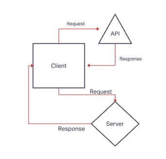
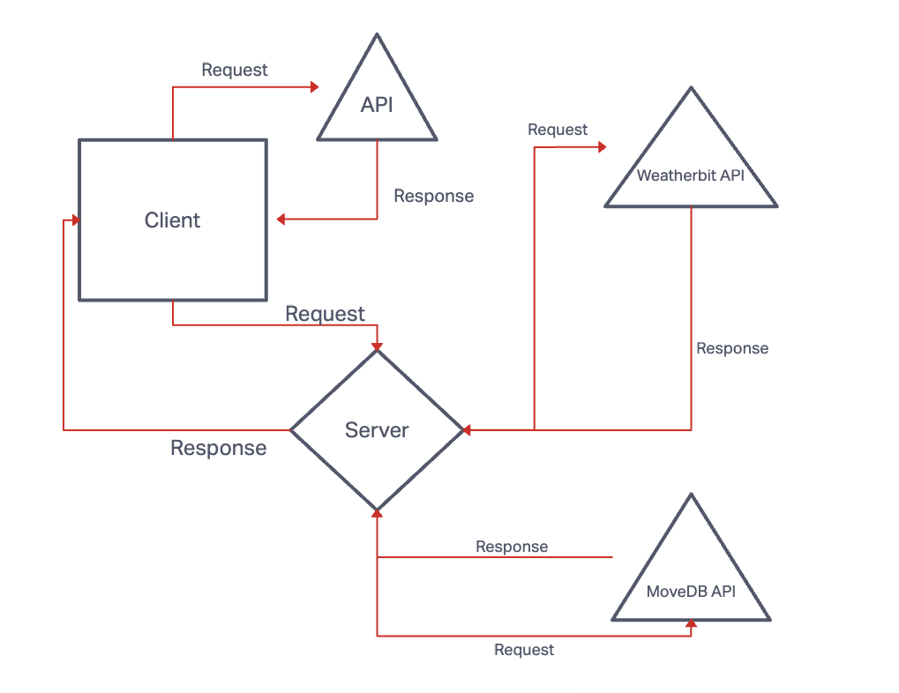
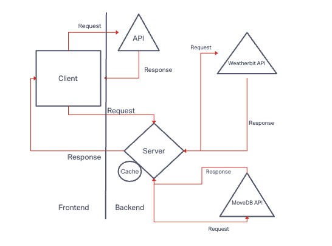

# city-explorer-api

Name of feature: __Advanced Topics__

Estimate of time needed to complete: _2 hrs____

Start time: _2:30pm____

Finish time: _4:30:00 pm____

Actual time needed to complete: __5 hrs___

**Author**: Tiffani Rice
**Version**: 1.0.0 (increment the patch/fix version number if you make more commits past your first submission)

## Overview
A website that allows users to see realtime weather, map, and movie information simply by typing in the name of a city. This application used advanced APIs and a caching support feature.
## Getting Started
Def started it like the Black Eyed Peas.

## Architecture
Javascript components that get data from storage

## Change Log

## Credit and Collaborations
Anthony Sinitsa, Tony Regalado
